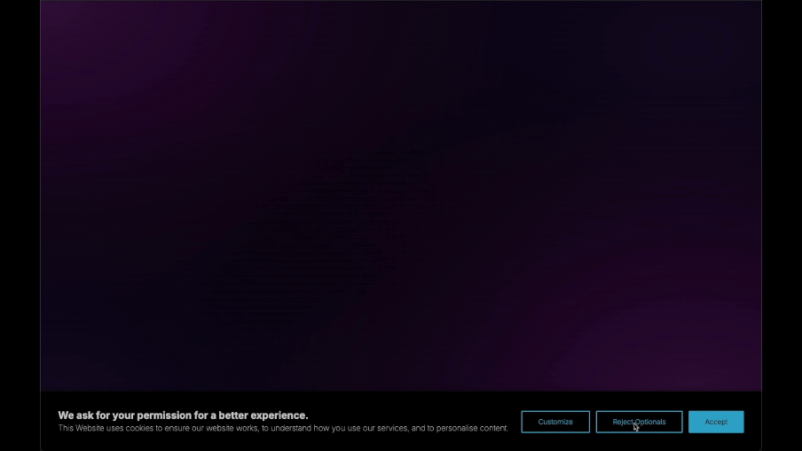

<p align="center">
  <a href="https://startbase.dev" target="_blank">
    
  </a>
</p>

<h1 align="center">@start-base/react-consent-manager</h1>

<p align="center">
  Customizable React library for managing user consent with cookie banners and privacy settings in compliance with regulations like GDPR.
</p>
<p align="center">
<a href="https://www.npmjs.com/package/@start-base/react-consent-manager">@start-base/react-consent-manager</a> is part of the <a href="https://www.npmjs.com/package/@start-base/start-ui">@start-base/start-ui</a> UI library but can also be used individually.
</p>

<p align="center">
    <a href="https://github.com/startbase-dev/react-consent-manager/blob/main/LICENSE"></a>
    <a href="https://www.npmjs.com/package/@start-base/react-consent-manager"></a>
    <a href="https://www.npmjs.com/package/@start-base/react-consent-manager"></a>
    <a href="https://www.npmjs.com/package/@start-base/react-consent-manager"></a>
</p>

---

<p align="center">
    
</p>

## Documentation

For full documentation, visit [start-ui.startbase.dev](https://start-ui.startbase.dev/docs/overlayComponents/consentManager).

## Installation

```bash title="Terminal"
npm install --save @start-base/react-consent-manager
```

Make sure to you import `style.css` to your App root.

```jsx title="layout.js"
import "@start-base/react-consent-manager/styles.css";
```

## Features

- CSS variables for theming are available for all components.
- Classnames are available for all components.
- Built-in dark mode support.

## Demos

For live demos of these components in action, please visit our [Storybook](https://react-consent-manager.vercel.app/) demo pages.

## Contributing

Contributions are welcomed. Feel free to submit pull requests and improvements to the project!

## Contributors

<table>
  <tr>
    <td align="center">
      <br />
      <sub><a href="https://github.com/yunusozcan">yunusozcan</a></sub>
    </td>
    <td align="center">
      <br />
      <sub><a href="https://github.com/emreonursoy">emreonursoy</a></sub>
    </td>
  </tr>
</table>
